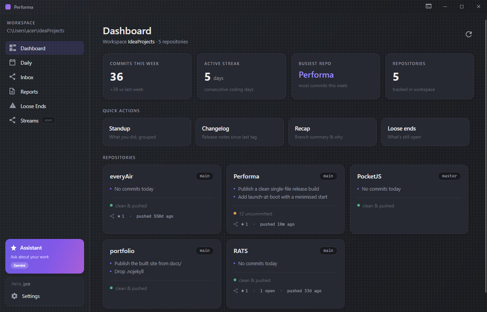
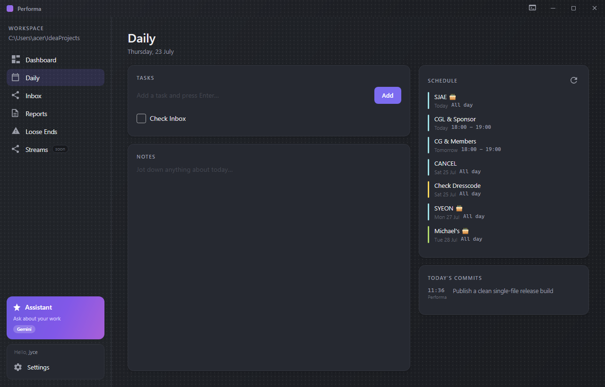
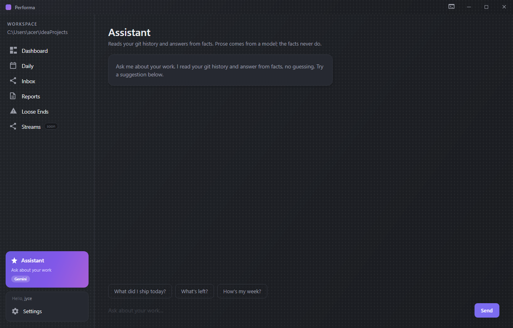
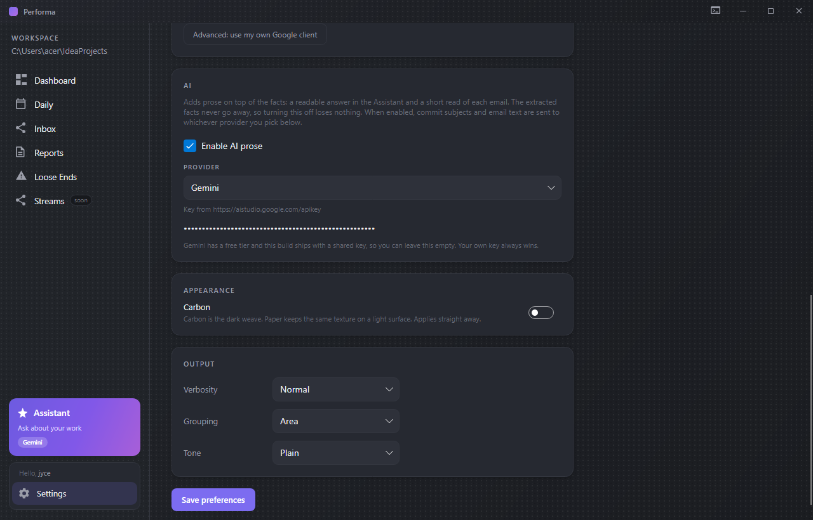

<h1 align="center">Performa</h1>

<p align="center">Let yourself be managed. A helper, summariser, standup scribe,</p>
<p align="center">changelog keeper, and cleans up after you 🧹. An all-rounder by your side,</p>
<p align="center">works from both local and remote git. Bring your own AI key and integrate it into the structure.</p>

You already told your computer what you did today. You told it in commits, in
calendar invites, in the fourteen emails you half-read. Performa reads all of
that back and hands you the day in one screen.

It runs on your machine. There is no account, no server, no telemetry. Your git
history never leaves the disk it lives on.



---

## Why this exists

Standups, changelogs, and "what did I get done this week" are all questions your
git log can already answer. Writing them by hand is transcription, and
transcription is the sort of work you should be able to hand off.

So Performa does the reading. It walks every repository in your workspace, works
out what changed and where you left things, and writes it up. The facts come
from git, deterministically. If a number appears in a Performa report, you can
go find the commit it came from.

That last part is the whole design. **The AI is optional and it never touches
the facts.** Turn it off and you still get every date, every link, every number.
All you lose is the prose wrapped around them.

---

## What it does

### The day, in one place

Tasks and notes on the left, your calendar and today's commits on the right. Not
a summary of your day, the actual thing: which meeting is next, what you pushed,
what you still owe yourself.



### An assistant that doesn't guess

Ask it what you shipped. It answers from your git history, and it says so. When
a model writes the prose, the answer is labelled with the model's name, so you
always know whether you're reading a fact or a paraphrase.



### An inbox that refuses to lose things

Most email summarisers hand you a tidy paragraph and quietly drop the deadline.
Performa's inbox extracts structure instead: every **date**, every **amount**,
every **link**, every **ask**, listed. The prose sits on top as a bonus, never
as a replacement, and the original is one click away, rendered exactly as Gmail
served it.

### Reports worth pasting

Standups, changelogs, branch summaries, and a loose-ends sweep. Output is styled
when you're reading it in a terminal and plain markdown the moment it's piped,
so it lands clean in Slack or a PR description without editing.

### It learns, without machine learning

Every report ends with accept / edit / reject. Trim one down hard and verbosity
drops a step. Pad one out and it rises. Reject the same report twice and the
grouping mode cycles. Plain rules you can read in the source, not a model you
have to trust.

---

## Bring your own model

The AI layer is opt-in, and you choose who answers. **Gemini**, **Claude**, or
**OpenAI**, picked from a dropdown, each keeping its own key so switching back
and forth never costs you a re-paste.



| Provider | Model | Key |
|---|---|---|
| Gemini | `gemini-flash-lite-latest` | Free tier. This build ships with a shared key, so it works with no setup. |
| Claude | `claude-opus-4-8` | Yours. Billed per token. |
| OpenAI | `gpt-4o-mini` | Yours. Billed per token. |

Gemini is the default because it's the only one of the three you can try without
a card on file. The two metered providers deliberately have **no** shipped
fallback key: an install should never spend someone else's money.

Adding a fourth is one class. Implement `IAiProvider`, add an enum value, done.

**Nothing is sent anywhere until you both enable AI and supply a key.** Every
provider call degrades to null on failure and the deterministic answer takes
over. That's enforced by tests, not just intent.

---

## Getting started

Grab `Performa.exe` from [releases](https://github.com/realjyce/Performa/releases)
and run it. One file, no installer, no .NET runtime needed. Windows 10 or 11,
64-bit.

Windows SmartScreen will warn you on first run because the binary isn't
code-signed. That's expected.

On first launch it asks your name, then offers GitHub and Google. Both are
optional and you can skip straight to the dashboard.

- **GitHub** uses the device flow: you approve a short code on github.com, and
  Performa never handles your password.
- **Google** is read-only, for Calendar and Gmail.

Tokens are stored in your user profile and never leave it. Settings has a switch
to launch Performa at boot; it starts minimised, so it's warm without
interrupting your login.

### From source

```bash
dotnet run --project src/Performa.Desktop
```

### The CLI

The same engine also runs headless:

```
performa                               dashboard: every repo's today, loose
                                       ends, and your week's velocity
performa init                          set your preferences (once)
performa standup                       what you did since your last standup
performa standup --since yesterday     ...or since a date, ref, or "yesterday"
performa changelog                     release notes since the last tag
performa changelog --from v1.0 --to v1.1
performa summary feature/nets          what changed on a branch, and why
performa loose-ends                    stale branches, unpushed commits,
                                       uncommitted work, TODO/FIXME markers
```

Global options: `--repo <path>` (defaults to the current directory),
`--format md|text|pretty`, `--no-prompt`.

Build it as a single native binary:

```bash
dotnet publish src/Performa.Cli -c Release -r win-x64
```

---

## How it's built

```
Performa.Core       git parsing, fact building, rendering, preferences
Performa.Cli        the terminal front end
Performa.Desktop    the Avalonia app
Performa.Tests      61 tests, including ones that build a real scratch
                    repository and run the whole pipeline against it
```

.NET 10, nullable reference types on, warnings as errors. Core makes no network
calls at all; every outbound request lives in the desktop layer, where you can
see it.

Two seams carry the extension points. `IEnricher` takes structured facts in and
gives prose out, so a smarter renderer can replace the deterministic one without
touching git parsing. `IAiProvider` is one method, and it's what makes the three
vendors interchangeable.

The UI is hand-rolled MVVM with no framework, verified by a headless Skia
harness in `tools/Shot` that renders pages to PNG. Every screenshot on this page
came out of it.

```bash
dotnet test
```

---

## What Performa will not do

- Send your code, commits, or email anywhere unless you switch AI on and give it
  a key.
- Write to your repositories. Everything is read-only except the clone button,
  which asks first.
- Summarise away the details. If a message contains a deadline, the deadline is
  on the card whether the model ran or not.

---

## Status

v1.0.0, and I use it daily. Streams is stubbed and marked "soon" in the sidebar
rather than pretending to work.

Built by [Jason Clarence](https://github.com/realjyce). MIT.
